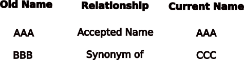

### What is Taxonomic Name Alignment?
-----
> Aligning taxonomy is a process of assuring the names in our collections are the most current and up to date according to an authority of interest. It involves comparing a list of inputed names to the authority's database and returning an output of resolved names. 

### Why is Taxonomic Alignment Important?
----
> Scientific names and the species they represent are hypotheses. As in all fields of science, these hypotheses should always be refined based upon the most current and accurate information. Species in the past may have been identified based upon a particular trait or an authority's species concept. As we collect more data from fields like systematics and population genetics, we are more capable of refining these designations to represent our most current knowledge. Its therefore important to standardize our collections to the most up to date designations based upon new information. 

### What Taxonomic Resources can we use to Align Names? 
-----

> Taxonomic databases that contain name designations are called "catalogues". Catalogues contain the necessary information for aligning old names with their most current counterparts if they have changed. Due to scope, species concepts, and project aims there are quite a few catalogues to choose from when aligning names. Some catalogues are designed in large scope to encompass a large portion of the tree of life, while others are more focused on particular clades. Depending on the group your working with, different catalogues may offer more up to date expert designations. 
> It's important to note that catalogues' name designations are *hypotheses*. They are not the absolute truth and are subjective to how the catalogue builds their interpretations. Available data & how we study particular organisms can change how catalogues establish what is and isn't a species. To address these issues its important to consider the following:
> * What type of catalogue am I using? Is it a catalogue that specializes on a particular clade/group? Is it a catalogue that aggregates other catalogue's interpretations?
> * What methods does the catalogue use to build its taxonomic backbone? Literature searches? Phylogenetic trees? A combination of methods? 
> * How complete is the catalogue? How current are the designations?

### How are Catalogues Structured?
-----
> There are various formats depending on the catalogue, but in general they all share the feature of linking names by a relationship. Two common relationships we will see are: 
- **Accepted Name**: This relationship shows that the name searched is registered as the most current/valid name according to the catalogue. 
- **Synonym**: This relationship suggests that the name searched has been remapped to an alternative name according to the catalogue.

### The Name-Alignment-Tool
-----
> Rather than going by hand and correcting your collection's names manually, there are tools available to align lists of hundreds to thousands of names to catalogue's standards. The tool we'll be showcasing today takes advantage github's interface, allowing a graphical type enviroment that many of us are used to.

> ## `More Info: How Does this tool Work?`
> If you are interested in how the tool actually aligns these names you can visit the repository for [Nomer](https://github.com/globalbioticinteractions/nomer). Nomer is a tool built by Jorrit for aligning names within GLOBI. 
{: .More Info}

## Next Up: Light Introduction to Github

