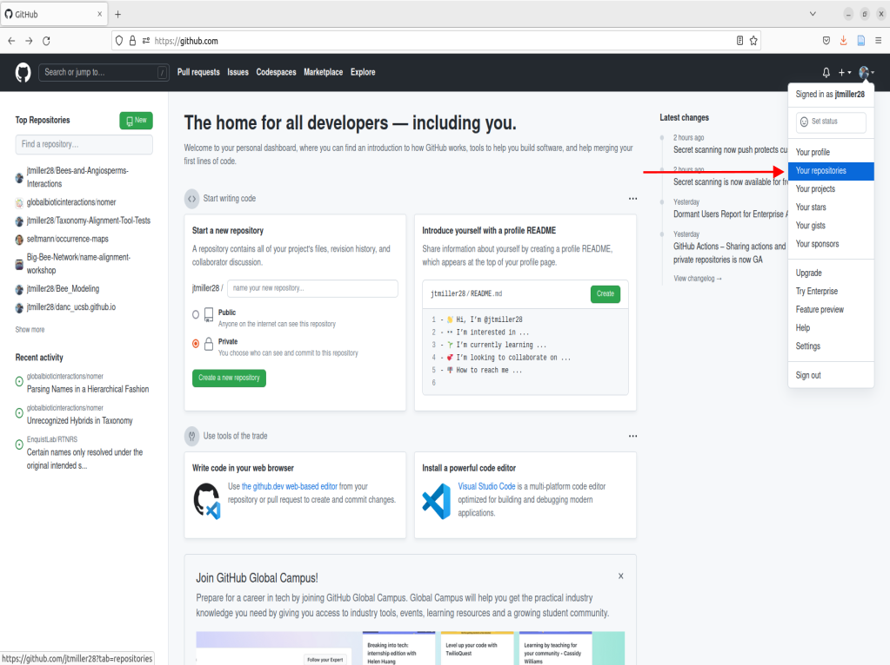
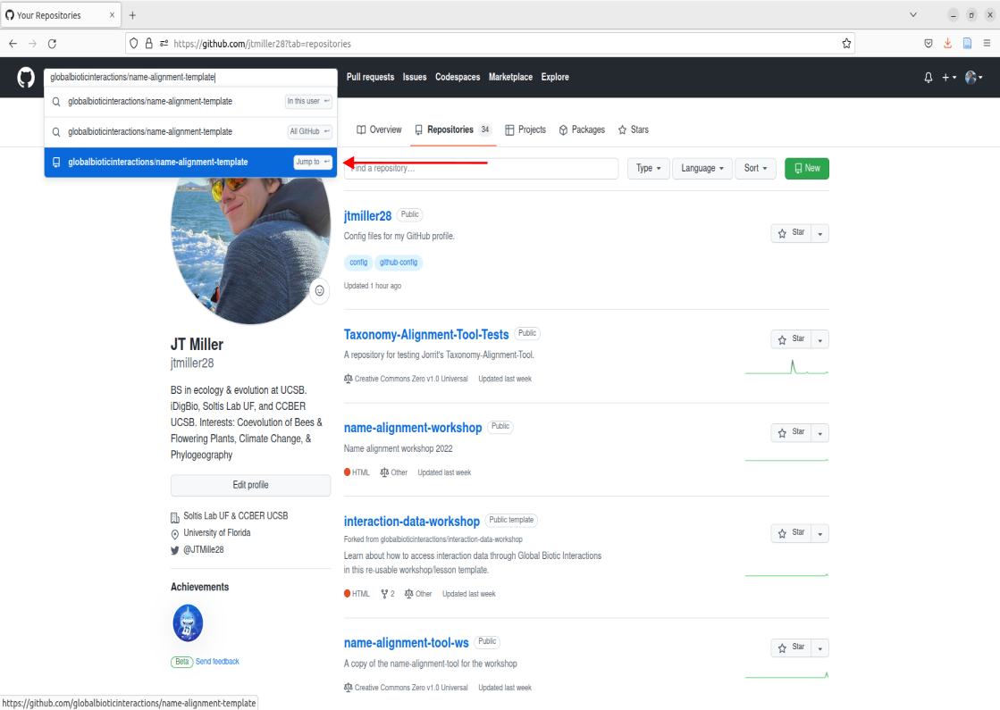
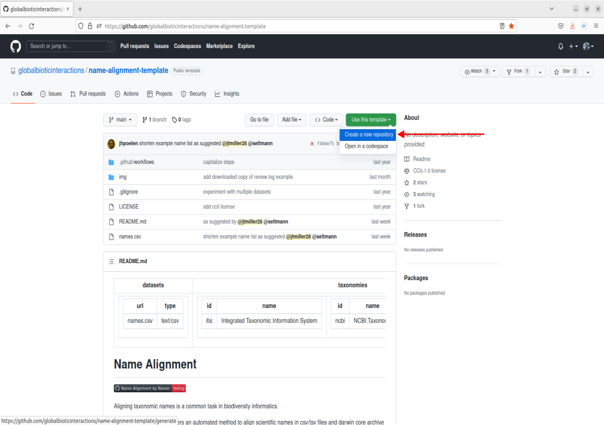

-----

### Getting started
---------------------------------
> To use Github you will need a github account as mentioned in the [setup instructions]. Please note you do NOT need Git downloaded onto your computer for this tutorial. We will be working in Github's graphical interface for the purpose of this lesson. 

### What is Github? 
--------------------------------
> Simply put github is a hosting service for software development and collaboration. Some of us use it to store versions of our code/analyses and others use it for development of software/applications. Today our aim isn't to utilize github for these aspects, but to interact with the name-alignment-tool that has been built on github. All you need to interact with the tool is to make a copy of the template repository. That probably sounds complicated at first so lets break it down into a few steps.

> Once you have made you're account, you will likely be taken to a page showing you're home activity/github's recommendations. From there, we can nagivate to the top right corner that displays your profile icon, click it, then navigate to the tab that says "Your repositories", go ahead and click that as well.

 

### What is a Repository or "Repo"?
---------------------------------
> Right now you should see the following page after navigating to your repositories: 

> This page contains what are called Repositories on github or for short "Repos". A repository is a location on github that hosts a collection of files associated with your work. Its analagous to a folder that holds all of the files for a associated project. The page we are currently on shows your repositories. If your new to github you currently won't have any repositories listed on this landing page. 
> Rather than building a repository completely from scratch, we're going to create a copy of one already built. To do this we can navigate to the repo that is the template for the name-alignment-tool.  

> Navigate over to the search bar in the top left corner. Enter in the following: `globalbioticinteractions/name-alignment-template`
> Click on the option that says "jump to". 
> This will bring you to the landing page for the name-alignment-template. This is the official repo that holds the tool made by Jorrit. Now we want to create a personal copy of the tool by creating a new repository based upon this template. To do this, navigate over to the green button in the middle right of the screen that says "Use this template", click it, and now you should see an option to create a new repository. Go ahead and click that. 

### Where can we find the name-alignment-tool and how do I use it?
> Link to globi's name-alignment-tool (alternatively could show searching for it) IF search show pictures...
> Introduce the basics of what's on a Repo, highlighting whats usually on a README, what are all of those file paths in the box, and how to use a template.
> Show that your copy is your own now! Feel free to add files and change things, if something breaks you can always delete it and copy a new one! 
