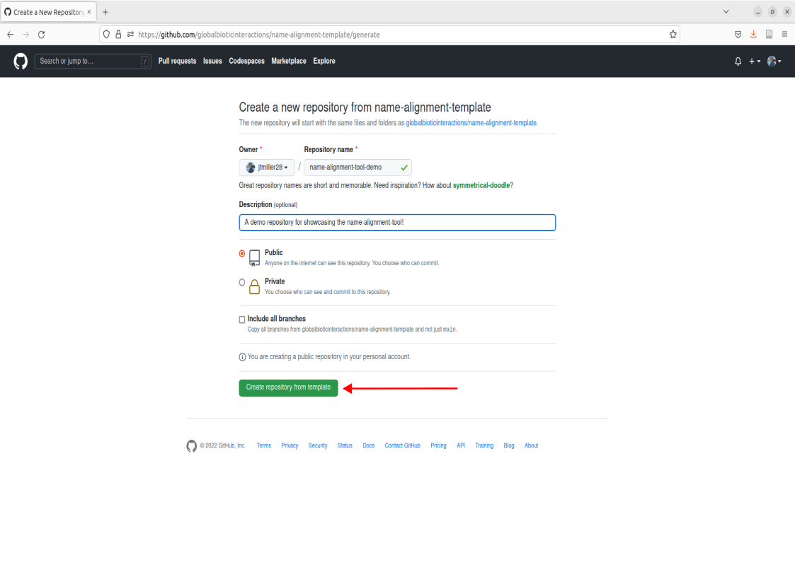
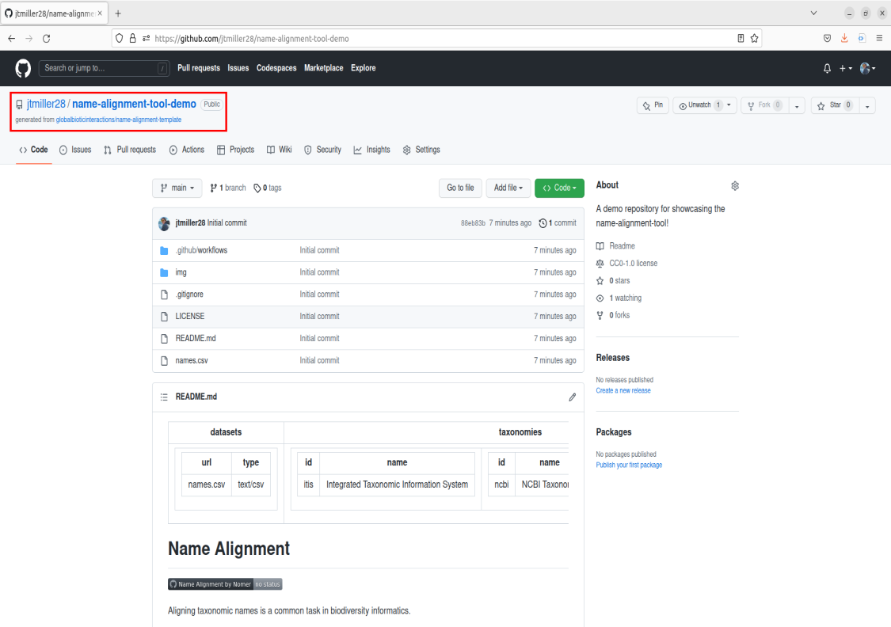
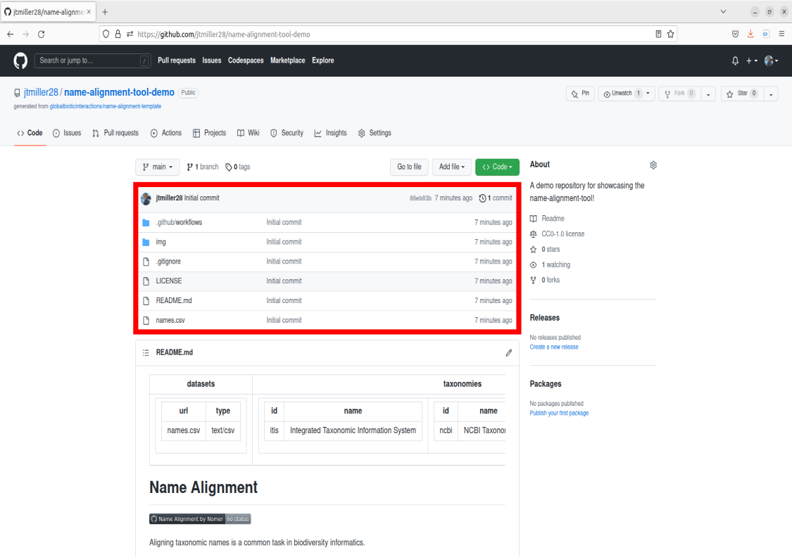
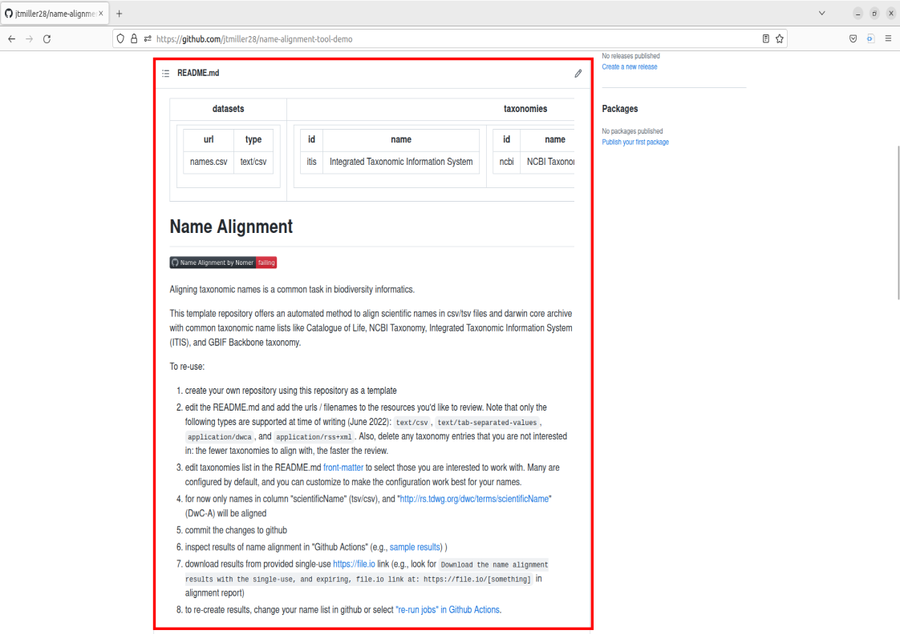

-----

### Getting started
---------------------------------
> To use Github you will need a github account as mentioned in the [setup instructions](https://big-bee-network.github.io/name-alignment-workshop/setup). Please note you do **not** need Git downloaded onto your computer for this tutorial. We will be working in Github's graphical interface for the purpose of this lesson. 

### What is Github? 
--------------------------------
> Simply put github is a hosting service for software development and collaboration. Some of us use it to store versions of our code/analyses and others use it for development of software/applications. Today our aim isn't to utilize github for these aspects, but to interact with the name-alignment-tool that has been built on github. All you need to interact with the tool is to make a copy of the template repository. That probably sounds complicated at first so lets break it down into a few steps.

> Once you have made you're account, you will likely be taken to a page showing you're home activity/github's recommendations. From there, we can nagivate to the top right corner that displays your profile icon, click it, then navigate to the tab that says "Your repositories", go ahead and click that as well.

 

### What is a Repository or "Repo"?
---------------------------------
> Right now you should see the following page after navigating to your repositories: 

> This page contains what are called Repositories on GitHub or for short "Repos". A repository is a location on GitHub that hosts a collection of files associated with your work. It is like a folder holding all the files for an associated project. The page we are currently on shows your repositories. If you are new to GitHub, you currently will not have any repositories listed on this landing page.  
> Rather than building a repository completely from scratch, we are going to create a copy of one already built. To do this we can navigate to the repo that is the template for the name-alignment-tool.  

> Navigate over to the search bar in the top left corner. Enter in the following: `globalbioticinteractions/name-alignment-template`
> Click on the option that says "jump to". 
> This will bring you to the landing page for the name-alignment-template. This is the official repo that holds the tool made by Jorrit. Now we want to create a personal copy of the tool by creating a new repository based upon this template. To do this, navigate over to the green button in the middle right of the screen that says "Use this template", click it, and now you should see an option to create a new repository. Go ahead and click that. 

> From here, you will be prompted to fill out some information for creating a new repository from the name-alignment-template. You will want to create some type of repo name, give it a description, choose the privacy setting you prefer, and then click the green button "Create repository from template". 

> Congrats! Now you should have your very own copy of the name-alignment-template. 

### Navitgating my New Repo
---------------------------------
> Now lets cover some basics for guiding ourselves around the repository. There is a _lot_ of information on this webpage, but for our purposes we are going only highlight what is necessary to operate the tool. 
> First, you see the directory of where your repository is stored by looking in the top left corner. It should be structured as username/name-of-repository. Take a look at this and make sure it is structured like this to confirm you made a copy of the template! 

> Recall that a repository is basically a folder containing files. The files can be visually seen on your repo's main Code page in the center box. This file box contains other info such as sub-folders/directories in the repositiory as well as time stamps for when they were last modified. 

> If you scroll down you should see a section with a subheader called README.md. Readmes are typically designed as front pages for repositories to display helpful information about how to use the repository. Typically readmes are designed to just convey information, however today we'll be exploring a unique application of editing the readme in order to use the name-alignment-tool, but more on that later! For the purposes of this example tool, we can also think of the README as the description of what our Name-alignment-tool does. 

> Continue on to the next lesson for a showcase of resolving names using your new tool! 
