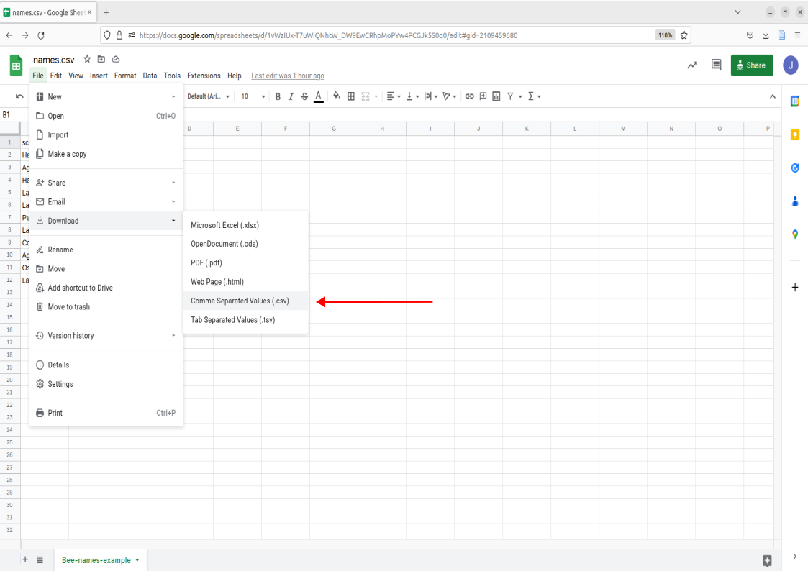
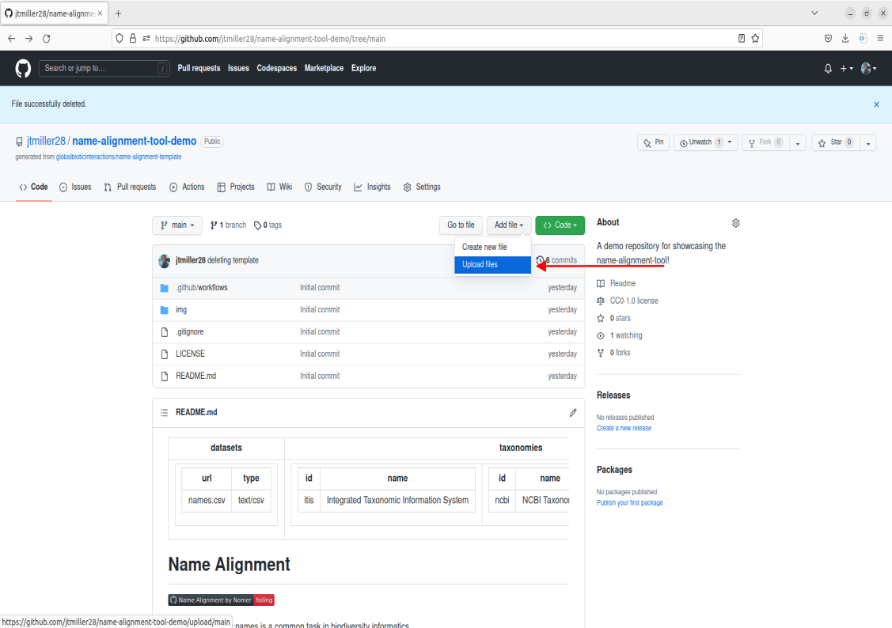
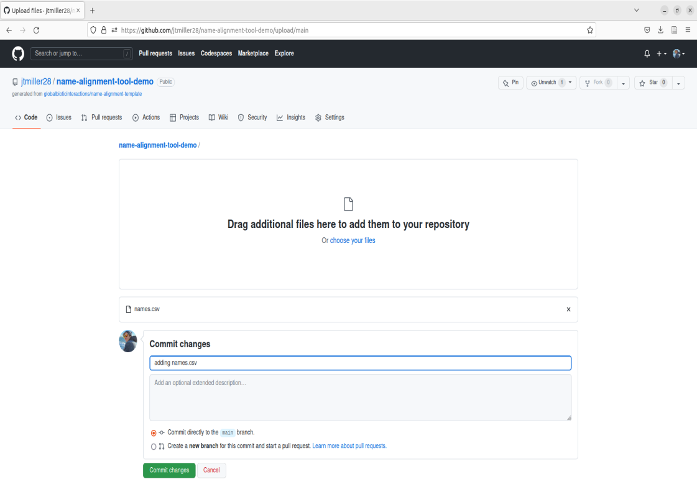

## Setup - remote directory & file structure

> For the tool to interact and read our files, we need either a file stored remotely on this github repository or a dwc archive link. For todays demonstration lets look at how we can upload a list of names to our remote directory for the github repository 

{ :Note} "Remote Directories" You can think of this as a google drive, basically a file storage system that operates on servers or the "cloud". Like google drive, you can create folders, add and organize files.  

> Lets first take a look at the file in our remote repository called names.csv. Navigate to the files and go ahead and click on it. 

> This is an example of how the names should be formatted when inputted into the tools. The two main things to notice that are a requirement for your names to align correctly are:
  1. the "scientificName" field **must** be present in the first row.
  2. from the second row on, each name will occupy its own row

> This example names.csv file contains names we could match, but lets try uploading a different list of names containing bees. We can get rid of the old name file by either deleting it, to do this click on the trashcan icon in the right corner of the file. 

## Example names

example file: [names.csv](../names.csv) TODO update link below replacing the google sheets

> Go to this example [name file](https://docs.google.com/spreadsheets/d/1vWzIUx-T7uWiQNhtW_DW9EwCRhpMoPYw4PCGJk5S0q0/edit?usp=sharing) containing a comma delimited file of bee names for our worked through example. 
> From the google sheets, you can select File > Download > Comma Seperated Values (.csv) 

> Save this .csv file somewhere on your computer that you can easily access. I'd suggest somewhere like Documents for simplicity. Next we're going to upload this file onto our local repository.
> this is done by:
 1. Click Add File, then select 'Upload files'.
 
 2. Click on 'choose your files', select the downloaded names.csv  
 3. Next we will need to "Commit" our changes to the repository, this is analagous to saving a new version. You'll need to write some sort of message before commiting, its recommended that the message is brief and to the point in order to jog your memory if you need to go back. Write a message and then click the green "Commit" button. 

You should now see the file in the Repo called names.csv! This means the file is now stored locally on this github repo.

## Running name alignment
> To use the tool we will be commiting changes to the README. To do this we're going to select the pencil icon located on the top right of the README box.

> This will bring you to a new page where we can edit the readme. Some things to take note of are:
1. The subsection called datasets: Here the tool will search the repository's local directory for the name of the file we put here. names.csv is already placed so no edits will be needed here. 
2. The subsection called taxonomies: Here, you can edit which catalogues are used for matching by either adding or removing the '#'. For example, if I didn't want to use the catalogue itis I could add '#' in front of the id and name field for that catalogue. For the purposes of this worked example we already have the three catalogues, itis, ncbi, and discoverlife active and ready to match. 

> You can now run name alignment. Note that you technically cant commit if there are no changes to the readme, so just add a '#' to the end of the document since we know that won't do anything. Write a commit message like "Run name-alignment" and Commit changes.

> Alignment will be processing in the background of the github, however we can also see the progress happening in real time by looking at our most recent commit history. To do this select the numbers representing our most recent commit:
 
> Next click on the orange dot on the left of the commit message you put in, this should open a window that has a details link. Click that. 

> This will bring you to the background process where the name-alignment-tool is working on aligning names. If you want to see a detailed view on the process you can click on 'Align names' for more information. 

## Accessing Aligned Names
> To access the file created with the aligned dataset, navigate to the <> Code subheader on the top left of the github repository. This will bring us back to the main page of the repository. 
> Scroll down to the readme. Under the header 'Name Alignment', you should see a button called 'Name Alignment by Nomer'. Click on that button. 
 
> This button will take us to a new web page that allows us to download the names. [This part is in the process of implementation, add a png if needed later]

Up next we're going to interpret our aligned names
