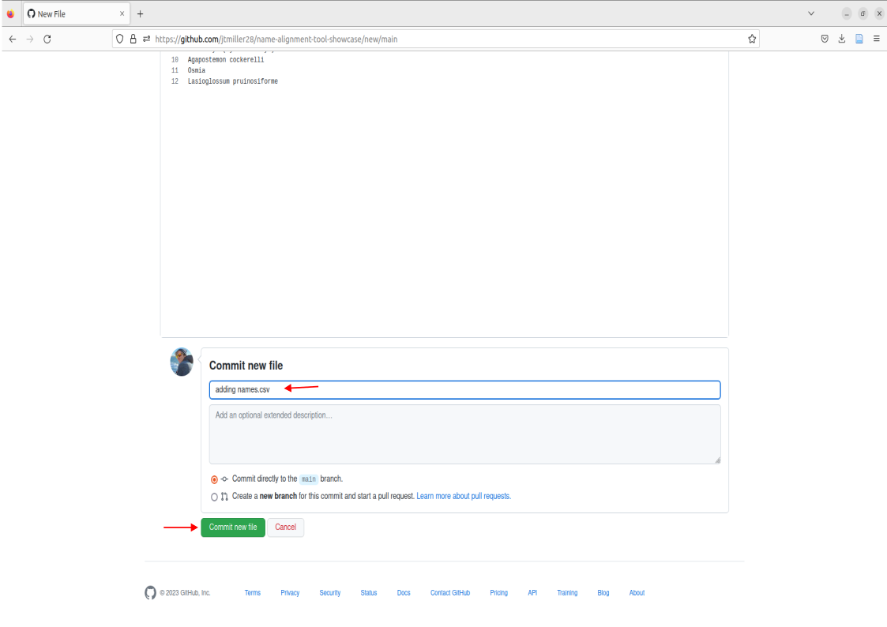

## Setup - remote directory & file structure

> For the tool to interact and read our files, we need either a file stored remotely on this github repository or a dwc archive link. For todays demonstration lets look at how we can upload a list of names to our remote directory for the github repository 

{ :Note} "Remote Directories" You can think of this as a google drive, basically a file storage system that operates on servers or the "cloud". Like google drive, you can create folders, add and organize files.  

> Lets first take a look at the file in our remote repository called names.csv. Navigate to the files and go ahead and click on it. 

> This is an example of how the names should be formatted when inputted into the tools. The two main things to notice that are a requirement for your names to align correctly are:
  1. the "scientificName" field **must** be present in the first row.
  2. from the second row on, each name will occupy its own row

> Note that scientificName must be present, but it can be in any column of the dataset. The tool will select only the column labelled scientificName. 

> This example names.csv file contains names we could match, but lets try uploading a different list of names containing bees. We can get rid of the old name file by either deleting it, to do this click on the trashcan icon in the right corner of the file. 

## Example names

example file: [names.csv](../names.csv) 

> Click on this link [names.csv](../names.csv) containing a comma delimited file of bee names for our worked through example. This will download a list of bee names to your personal device.  
 

> This will bring you to a page containing the names we're going to align for this tutorial. We're going to copy these names, create a new file, and paste these names for our resolution. 
> this is done by:
 1. Click Add File, then select 'Create new file'.
 
 2. Name your new file as "names.csv" 
 3. Paste your names into the empty box. Do this by right clicking and selecting 'paste'
  
 4. Next we will need to "Commit" our changes to the repository, this is analagous to saving a new version. You'll need to write some sort of message before commiting, its recommended that the message is brief and to the point in order to jog your memory if you need to go back. Write a message and then click the green "Commit" button. 

You should now see the file in the Repo called names.csv! This means the file is now stored remotely on this github repo.

## Running name alignment
> To use the tool we will be commiting changes to the README. To do this we're going to select the pencil icon located on the top right of the README box.

> This will bring you to a new page where we can edit the readme. Some things to take note of are:
1. The subsection called datasets: Here the tool will search the repository's local directory for the name of the file we put here. names.csv is already placed so no edits will be needed here. 
2. The subsection called taxonomies: Here, you can edit which catalogues are used for matching by either adding or removing the '#'. For example, if I didn't want to use the catalogue itis I could add '#' in front of the id and name field for that catalogue. For the purposes of this worked example we already have the three catalogues, itis, ncbi, and discoverlife active and ready to match. 

> You can now run name alignment. Note that you technically cant commit if there are no changes to the readme, so just add a '#' to the end of the document since we know that won't do anything. Write a commit message like "Run name-alignment" and Commit changes.

> Alignment will be processing in the background of the github, however we can also see the progress happening in real time by looking at our most recent commit history. To do this we can select the button called 'Name Alignment by Nomer' 
 
> This will bring you to a page indicating that the alignment is operating by your commit history. The circle icon next to the commit message will either be yellow indicating alignment is in progress or green indicating alignment has finished. You can click on this commit message to access the alignment. 

> While in progress, you can view the alignment tool in action by clicking on the "align" button. 

> This will bring you to the background process where the name-alignment-tool is working on aligning names. 

> Once alignment has finished, we can now access the alignment report by clicking on the tab called "alignment report" 

> This will download the names as a zip file to your computer's downloads. You can then access the alignment by clicking on the downloaded file. 
  
> 
## Accessing Aligned Names
> To open the names, click on the names-aligned.tsv
 

Up next we're going to interpret our aligned names
