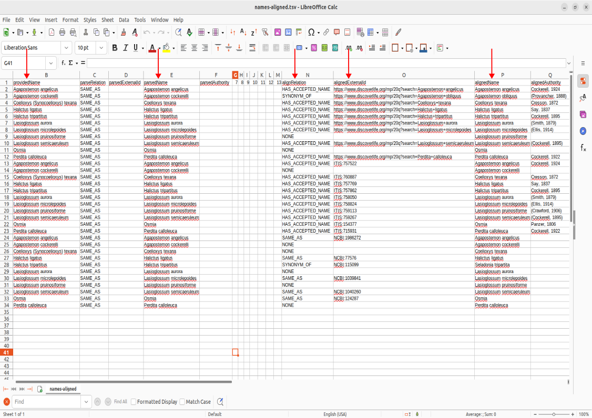

## Interpreting the output
---
> So we now have our output table, but what does all of it mean? 

> There is quite a bit here so lets break down the fields that are of particular interest:
1. The field providedName represents the scientificName field we provided in our input to the tool.
2. The field parsedName represents the scientificName after undergoing parsing, parsing is a process where extranoeous information is truncated out of the name if a matching scheme supports it (e.g. Authorship/Authority). Please note that subgenuses are parsed out *change?* 
3. The field alignRelation can have three possible values: 
  * HAS_ACCEPTED_NAME - a name is matched and is up to date/current
  * SYNONYM_OF - name is matched, but has been identified as synonymous to another name
  * NONE - indicates that there was no match found in that particular catalogue. 
4. the field alignedExternalId indicates the catalogue the name was matched to. These are often abbrievated containing the ID or url within the catalogue to reference that name alignment. 
5. the field alignedName is the name relation matched to the parsedName. 
6. the field alignedRank is the taxonomic level of the alignedName (i.e. Genus, species, etc)
7. the field alignedPath shows a 'piped' list of the alignedNames taxonomic designation. (Domain | Kingdom | Phylum | Class | Order | Family | Genus | Species)

## Conclusion & Further Discussion
> That about wraps up the basics you'll need to use this tool. We hope that you found this tutorial helpful and that you can use this tool to ease your workflow in keeping the collections up to date. If you are interested in more details of how names are aligned be sure to visit [Nomer](https://github.com/globalbioticinteractions/nomer) github repo, and if you have any questions/problems with the tool you can raise an issue on the [name-alignment-tool](https://github.com/globalbioticinteractions/name-alignment-template) repo. 

> When writing an issue, its best to be explicit about a the problem you run into or are trying to ask. Vague problems are much harder to solve after all! Here's an example of an issue: 
> 
Things to note:
1. Write a brief but concise description of the problem you are running into
2. (Not included in this example, but better practice) A brief description on what you think should be intended. This is also a great kickstarter that can lead into some really interesting discussions!
3. Copy-Paste either outputs or visuals highlighting the issue (in this example I included the name-alignment-tool table outputs). 

#### Discussion
> Thoughts about the tool or name alignment in general?
### In case we have extra time! 
> Now that we've learned the basics of the tool, lets go ahead and try some names! 
> Feel free to post any scientificName in the chat, and lets see how name alignment handles it! 
> Complicated ones (Hononyms or ones known to have unstable taxonomy are encouraged!)
> A [name list](../complex-names.csv) of bees that can remap to unexpected names 

 
> 

